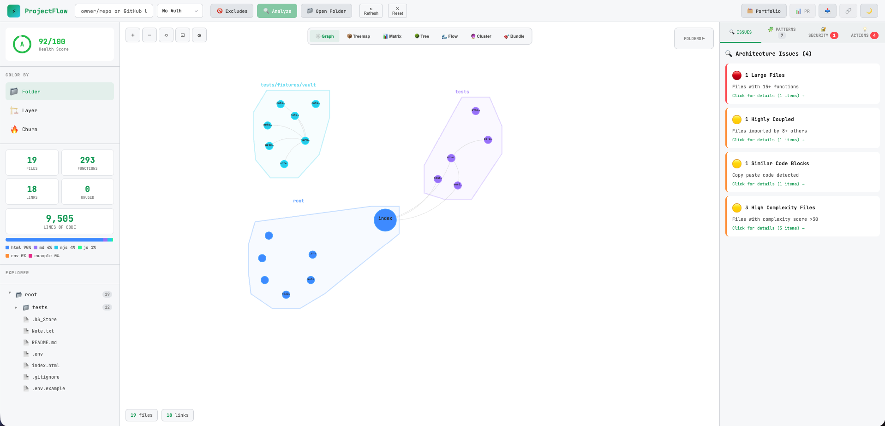

<div align="center">

# ⚡ ProjectFlow

### Visualize Your Codebase Architecture in Seconds

**Zero setup. No installation. Just paste a GitHub URL.**

[](https://opensource.org/licenses/MIT)
[](http://makeapullrequest.com)
[](https://Bappyllcg.github.io/projectFlow/)

[**🚀 Try it Live**](https://Bappyllcg.github.io/projectFlow/) · [Report Bug](https://github.com/Bappyllcg/projectFlow/issues) · [Request Feature](https://github.com/Bappyllcg/projectFlow/issues)



</div>

---

## Why ProjectFlow?

Ever opened a new codebase and felt completely lost? **ProjectFlow** turns any GitHub repository or local codebase into an interactive architecture map in seconds.

- **No installation required** — runs entirely in your browser
- **No data collection** — your code never leaves your machine
- **No accounts** — just paste a URL or select local files and go
- **Works offline** — analyze local files without internet

```
⚡ Paste URL / Select Files → See Architecture → Make Better Decisions
```

---

## Features

### 🗺️ **Interactive Dependency Graph**
See how your files connect at a glance. Click any node to highlight its dependencies. Drag, zoom, and explore.

### 💥 **Blast Radius Analysis**
*"If I change this file, what breaks?"* — ProjectFlow answers this instantly. Select any file and see exactly how many files would be affected by changes.

### 👥 **Code Ownership**
Know who owns what. See the top contributors for any file based on git history. Perfect for code reviews and knowing who to ask.

### 🔐 **Security Scanner**
Automatic detection of:
- Hardcoded secrets & API keys
- SQL injection vulnerabilities
- Dangerous `eval()` usage
- Debug statements in production code

### 🧩 **Pattern Detection**
Automatically identifies:
- Singleton patterns
- Factory patterns
- Observer/Event patterns
- React custom hooks
- Anti-patterns (God Objects, high coupling)

### 📊 **Health Score**
Get an instant A-F grade for your codebase based on:
- Dead code percentage
- Circular dependencies
- Coupling metrics
- Security issues

### 🔥 **Activity Heatmap**
Color files by commit frequency to see which parts of your codebase are most actively developed.

### 📋 **PR Impact Analysis**
Paste a PR URL to see exactly which files it affects and calculate the blast radius of proposed changes.

### 🗂️ **AI Portfolio Generator** *(New!)*
Generate professional project portfolio entries for your development company using AI:
- **One-Click Generation** — Analyzes file names, function names, dependencies, and architecture patterns to create accurate portfolio content
- **OpenRouter Integration** — Uses any AI model via OpenRouter (free models supported)
- **Editable Fields** — Project About, Service, Role, Challenge, Solution, Measurable Impact, and Tags
- **Multiple Views** — Edit, Preview, and JSON export tabs
- **Copy & Export** — Copy formatted text or raw JSON for your portfolio website

### 📝 **Markdown & Wiki-Link Graph**
Point ProjectFlow at an Obsidian vault or any markdown directory to see notes as a connected graph. Both `[[wiki-links]]` and `[text](./relative.md)` links become edges; each note is a `note`-layer node (distinct color) with a `dependencies[]` array in the JSON export.

### 💻 **Local File Analysis**
Analyze code directly from your computer without uploading to GitHub:
- **Privacy First:** Your code never leaves your machine
- **Offline Support:** Works without internet connection
- **Drag & Drop:** Simply drag files or folders to analyze
- **Folder Scanning:** Recursively analyze entire project structures
- **Exclude Patterns:** Skip attachments, caches, generated assets, and other irrelevant paths before scanning
- **Instant Results:** All processing happens in your browser

---

## Privacy First

**Your code stays on your machine.** ProjectFlow:

- ✅ Runs 100% in the browser
- ✅ Makes API calls directly from your browser to GitHub
- ✅ Never stores your code or tokens
- ✅ Works with private repos (just add your token locally)
- ✅ No analytics or tracking

Your GitHub token (if used) is only stored in your browser's memory and is cleared when you close the tab.

---

## Quick Start

### Option 1: Use Online (Recommended)
Just visit [ProjectFlow](https://Bappyllcg.github.io/projectFlow/) and paste any GitHub URL.

### Option 2: Self-Host
```bash
# Clone the repo
git clone https://github.com/Bappyllcg/projectFlow.git

# That's it! Just open index.html in your browser
open index.html

# Or serve with a local server (needed for .env support)
python3 -m http.server 8888
```

No build process. No dependencies. No npm install. **It's just one HTML file.**

### Option 3: Analyze Local Files
You can now analyze code directly from your local machine without uploading to GitHub:

1. Open ProjectFlow in your browser
2. Click the "📁 Open Folder" button
3. Select the folder or files you want to analyze
4. ProjectFlow will process them entirely in your browser

**Perfect for:**
- Private projects you don't want to upload
- Offline development
- Quick local analysis before committing
- Working with sensitive code

---

## Usage

### Public Repositories
```
Just paste: facebook/react
Or full URL: https://github.com/facebook/react
```

### Private Repositories
1. Create a [GitHub Personal Access Token](https://github.com/settings/tokens) with `repo` scope
2. Paste it in the Token field
3. Analyze your private repos

### Local Files
Click the "📁 Open Folder" button to analyze code from your computer:
- **Folder Analysis:** Select a folder to analyze all supported files recursively
- **File Selection:** Choose specific files to analyze
- **Custom Excludes:** Add patterns like `uploads/**`, `**/cache/**`, or `*.png` before scanning

All processing happens locally in your browser — nothing is uploaded.

### Shareable Links
After analysis, click 🔗 to copy a shareable link. Anyone can re-run the same analysis.

### 📤 **Export Reports**
Export your analysis in multiple formats for further processing:

- **JSON Report** - Complete analysis data including:
  - Repository metadata and health score
  - All files with functions, dependencies, and churn data
  - Complete function statistics with callers and usage metrics
  - Security issues, patterns, and architecture issues
  - Duplicate code detection and layer violations
  - Suggestions and recommendations
  - Language breakdown and folder structure
  
  Perfect for programmatic analysis, CI/CD integration, or custom reporting tools.

- **Markdown Report** - Human-readable formatted report
- **Plain Text Report** - Simple text format
- **SVG Image** - Export the dependency graph visualization
- **Raw JSON** - Simplified data export

Click the 📤 Export button in the top bar after analysis to access all export options.

### 🗂️ **AI Portfolio Generator**
Generate project portfolio content using AI after analyzing a repository:

1. Analyze a repository or local folder
2. Click the **🗂️ Portfolio** button in the top bar
3. Click **✨ Generate with AI**
4. Edit the generated content as needed
5. Copy or export in your preferred format

#### Configuration

Create a `.env` file in the project root (when self-hosting with a local server):

```env
# Get your API key at: https://openrouter.ai/keys
OPENROUTER_API_KEY=sk-or-your-api-key-here
OPENROUTER_MODEL=qwen/qwen3.8-27b:free
```

Or configure directly in the app by clicking the ⚙️ gear icon in the Portfolio modal. Settings are saved in your browser's localStorage.

> **Note:** `.env` file loading requires serving via a local HTTP server (`python3 -m http.server 8888`). When using GitHub Pages or opening `index.html` directly, use the in-app settings instead.

---

## Supported Languages

ProjectFlow extracts functions and analyzes dependencies for:

| Language | Extensions |
|----------|------------|
| JavaScript | `.js`, `.jsx` |
| TypeScript | `.ts`, `.tsx` |
| HTML (inline scripts) | `.html`, `.htm`, `.xhtml` |
| Python | `.py` |
| Java | `.java` |
| Go | `.go` |
| Ruby | `.rb` |
| PHP | `.php` |
| Vue | `.vue` |
| Svelte | `.svelte` |
| Rust | `.rs` |
| C | `.c`, `.h` |
| C++ | `.cpp`, `.cc`, `.cxx`, `.hpp`, `.hh`, `.hxx` |
| C# | `.cs` |
| Swift | `.swift` |
| Kotlin | `.kt`, `.kts` |
| Scala | `.scala`, `.sc` |
| Groovy | `.groovy`, `.gvy` |
| Elixir | `.ex`, `.exs` |
| Erlang | `.erl`, `.hrl` |
| Haskell | `.hs`, `.lhs` |
| Lua | `.lua` |
| R | `.r`, `.R` |
| Julia | `.jl` |
| Dart | `.dart` |
| Perl | `.pl`, `.pm` |
| Shell | `.sh`, `.bash`, `.zsh`, `.fish` |
| PowerShell | `.ps1`, `.psm1`, `.psd1` |
| F# | `.fs`, `.fsi`, `.fsx` |
| OCaml | `.ml`, `.mli` |
| Clojure | `.clj`, `.cljs`, `.cljc` |
| Elm | `.elm` |
| VBA | `.vba`, `.bas`, `.cls`, `.xlsm`, `.xlsb`, `.xlam` |

---

## Visualization Modes

| Mode | Description |
|------|-------------|
| 📁 **Folder** | Color by directory structure |
| 🏗️ **Layer** | Color by architectural layer (UI, Services, Utils, etc.) |
| 🔥 **Churn** | Color by commit frequency (hot spots) |
| 💥 **Blast** | Color by impact when a file is selected |

---

## Keyboard Shortcuts

| Key | Action |
|-----|--------|
| `Enter` | Analyze repository |
| `+` / `-` | Zoom in/out |
| `Escape` | Close modal |

---

## API Limits

GitHub API has rate limits:
- **Without token:** 60 requests/hour
- **With Personal Access Token:** 5,000 requests/hour
- **With GitHub App:** 5,000 requests/hour per installation

### Authentication Methods

#### Personal Access Token (PAT)
1. Create a [GitHub Personal Access Token](https://github.com/settings/tokens) with `repo` scope
2. Paste it in the Token field
3. Analyze your private repos

#### GitHub App Authentication
For teams and organizations, GitHub App provides better security and higher rate limits:

1. Create a [GitHub App](https://github.com/settings/apps) with repository permissions
2. Install the app on your organization or personal account
3. Generate an installation access token
4. Paste the token in the Token field

**Benefits of GitHub App:**
- ✅ Fine-grained permissions control
- ✅ Revocable access per installation
- ✅ Higher rate limits (5,000 requests/hour)
- ✅ Audit logging and security monitoring
- ✅ No need to share personal credentials

For larger repositories or team usage, we recommend using GitHub App authentication.

---

## Architecture

```
┌─────────────────────────────────────────────────┐
│                   ProjectFlow                   │
├─────────────────────────────────────────────────┤
│  ┌──────────┐  ┌──────────┐  ┌──────────┐      │
│  │  Parser  │  │  GitHub  │  │    D3    │      │
│  │  Module  │  │   API    │  │  Graph   │      │
│  └──────────┘  └──────────┘  └──────────┘      │
│        │              │              │          │
│        └──────────────┼──────────────┘          │
│                       │                         │
│        ┌──────────────┼──────────────┐          │
│        │              │              │          │
│  ┌─────▼────┐  ┌──────▼──────┐  ┌───▼───┐     │
│  │ Portfolio │  │  React App  │  │ Export │     │
│  │ AI Gen   │  │ (Single File)│  │ Engine │     │
│  └──────────┘  └─────────────┘  └───────┘     │
└─────────────────────────────────────────────────┘
```

**Zero dependencies to install.** Everything runs from CDNs:
- React 18
- D3.js 7
- Babel (for JSX)
- OpenRouter API (optional, for AI portfolio generation)

---

## Contributing

We love contributions! Here's how:

1. Fork the repo
2. Make your changes to `index.html`
3. Test locally (just open in browser)
4. Submit a PR

If you're editing the markdown / wiki-link parser, Node.js unit tests live under `tests/` and run with no dependencies:

```bash
node --test tests/
```

`tests/verify-brain-vault.mjs` is an optional end-to-end script that runs the extractor pipeline against a local markdown vault (set `BRAIN_VAULT=/path/to/vault` or edit the default).

### Ideas for Contributions
- [ ] Add support for more languages
- [ ] Improve function extraction regex
- [ ] Add more design pattern detection
- [ ] Export to different formats (PNG, PDF)
- [ ] Add code complexity metrics
- [ ] Improve AI portfolio prompt for specific project types

---

## FAQ

**Q: How does it work without a backend?**
> ProjectFlow runs entirely in your browser. It calls the GitHub API directly from your browser and processes everything client-side.

**Q: Is my code safe?**
> Yes. Your code is fetched directly from GitHub to your browser. Nothing is sent to any server we control. Check the source — it's one file!

**Q: Can I use it offline?**
> Yes! With the Local Files feature, you can analyze code from your computer without any internet connection. Just click the "📁 Open Folder" button and select your files. All processing happens entirely in your browser.

**Q: Why is analysis slow?**
> We make individual API calls for each file to get content. With a token, you get higher rate limits and faster analysis.

**Q: How accurate is the dependency analysis?**
> It's based on function name matching, so it may miss some dynamic imports or renamed imports. It's designed for a quick overview, not 100% accuracy.

**Q: Does the AI Portfolio feature send my code to a server?**
> The AI portfolio feature sends only analysis metadata (file names, function names, stats) to OpenRouter — never your actual source code. You can review exactly what's sent in the browser's network tab.

**Q: Do I need to pay for the AI feature?**
> No. OpenRouter offers free models like `qwen/qwen3.8-27b:free`. Free models have rate limits, so you may need to wait a minute between generations. Paid models have no such limits.

---

## Star History

If you find ProjectFlow useful, please ⭐ the repo!

---

## License

MIT License — use it however you want.

---

<div align="center">

**Built with ⚡ by developers, for developers**

*Stop guessing. Start seeing.*

[GitHub](https://github.com/Bappyllcg/projectFlow) · [Live Demo](https://Bappyllcg.github.io/projectFlow/)

</div>
# projectFlow
